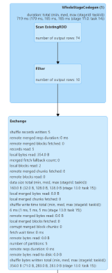
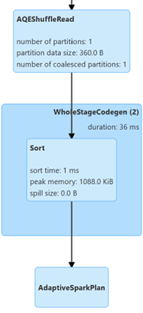
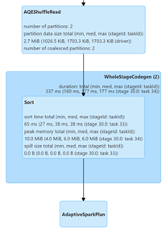
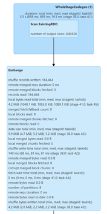
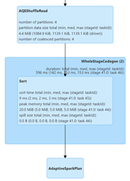

# Rapport - Assignement 01: Text Analytics avec PySpark

**Auteur :** Badr TAJINI  
**Cours :** Big Data Analytics (ESIEE 2025-2026)

---

## Introduction

Ce document présente le travail qu'on a réalisé pour l'Assignement 01. L'objectif était d'utiliser PySpark pour faire de l'analyse de texte sur un corpus de Shakespeare.

Le projet avait deux parties :

- **Partie A :** Compter les mots qui suivent "perfect".
- **Partie B :** Calculer la PMI (Pointwise Mutual Information) avec deux méthodes différentes : "Pairs" et "Stripes".

---

## Partie A : Comptage des "perfect x" followers

### Objectif
Trouver et compter les mots qui apparaissent juste après "perfect" sur la même ligne, sans faire de différence entre majuscules et minuscules.  
Il fallait aussi ignorer les mots qui n'apparaissaient qu'une seule fois (compte = 1).

### Comment on a fait

- **Lecture :** On a commencé par lire le fichier `data/shakespeare.txt`.
- **Traitement :** Tout a été mis en minuscules (`lower()`).
- **Filtrage :** On a gardé seulement les lignes contenant le mot "perfect".
- **Extraction :** Avec `flatMap`, on a parcouru les mots de ces lignes.  
  Si un mot était "perfect", on prenait le mot suivant comme *follower*.
- **Comptage :** `reduceByKey` pour compter chaque follower.
- **Filtrage final :** On a enlevé les followers dont le compte = 1 (`count > 1`).
- **Sauvegarde :** Résultats dans `outputs/perfect_followers.csv`.

### Preuves

- **Plan d'exécution :** `proof/plan_perfect.txt`.
- **Capture d'écran Spark UI (Partie A) :**  

**
**

---

## Partie B : Calcul PMI (Pairs & Stripes)

### Objectif
Calculer la PMI en `log10` pour les paires de mots apparaissant sur une même ligne, en utilisant deux implémentations RDD :  
**Pairs** et **Stripes**.

---

### Prétraitement (commun aux deux méthodes)

Pour chaque ligne :

- Mise en minuscules  
- **Tokenisation :** découpage en mots sur tout caractère non alphabétique  
- **Nettoyage :** suppression des tokens vides  
- **Limite :** on garde seulement les **40 premiers tokens uniques** de la ligne  

---

## B.1 - Approche "Pairs"

### Comment on a fait

- **Génération des paires :** chaque ligne devient un ensemble de paires uniques `(x, y)`.
- **Comptages :**
  - RDD pour compter les paires `count(x, y)`
  - RDD pour compter chaque mot individuellement `count(x)` et `count(y)`
- **Calcul PMI :**  
  `log10( (count(x, y) * N) / (count(x) * count(y)) )`  
  où **N** est le nombre de lignes.
- **Filtrage :** on garde seulement les paires avec co-occurrence ≥ K.
- **Sauvegarde :** échantillon dans `outputs/pmi_pairs_sample.csv`.

### Preuves

- **Plan d'exécution :** `proof/plan_pmi_pairs.txt`
- **Capture d'écran Spark UI (Pairs) :**  

**  
**

---

## B.2 - Approche "Stripes"

### Comment on a fait

- **Génération des stripes :** pour chaque mot `x`, création d’un dictionnaire `{y: 1}` répertoriant les co-occurrents.
- **Agrégation :** `reduceByKey` fusionne les dictionnaires pour chaque mot `x`.
- **Calcul PMI :** basé sur le RDD agrégé et les comptes individuels des mots.
- **Filtrage :** seuil K appliqué directement dans les dictionnaires.
- **Sauvegarde :** échantillon dans `outputs/pmi_stripes_sample.csv`.

### Preuves

- **Plan d'exécution :** `proof/plan_pmi_stripes.txt`
- **Capture d'écran Spark UI (Stripes) :**  

**
**

---

## Métriques & Reproductibilité

- **Environnement :** Détails dans `ENV.md`.
- **Métriques Spark :** consignées dans `lab1_metrics_log.csv`.
#### Metrics Log

| run_id | task        | note      | files_read | input_size_bytes | shuffle_read_bytes | shuffle_write_bytes | timestamp              |
|--------|-------------|-----------|------------|-------------------|---------------------|----------------------|-------------------------|
| r1     | perfect_x   | baseline  | 0          | 0                 | 360                 | 354                  | 2025-11-14T09:33:58     |
| r2     | pmi_pairs   | baseline  | 0          | 0                 | 2 831 152           | 2 726 298            | 2025-11-14T09:44:58     |
| r3     | pmi_stripes | baseline  | 0          | 0                 | 4 613 734           | 4 404 019            | 2025-11-14T09:46:34     |

---

## Conclusion Générale du Lab

L'analyse du fichier `lab1_metrics_log.csv` nous a permis de bien comparer nos trois tâches.

D'abord, on voit que la tâche **"perfect_x" (r1)** est très légère, avec quasiment aucun shuffle (354 bytes).  
C'est logique : on a énormément filtré les données au début, donc très peu de données ont été brassées.

Ensuite, on voit que les deux tâches **PMI** ont fait exploser le shuffle en passant à des Mégaoctets.

- **pmi_pairs (r2)** : ~2.7 MB de shuffle write  
- **pmi_stripes (r3)** : ~4.4 MB de shuffle write  

Cette augmentation est normale, car on a dû calculer les co-occurrences pour une grande partie du corpus, ce qui génère beaucoup de données intermédiaires.

Le point le plus important est la comparaison entre **"Pairs"** et **"Stripes"**.  
On remarque que **"Stripes" (r3)** a généré plus de shuffle que **"Pairs" (r2)**.

On aurait pu penser l'inverse, mais **"Stripes" crée des objets très gros** (les dictionnaires pour les mots fréquents comme *"the"*), tandis que **"Pairs" crée des millions de petits objets** (les paires `(x, y)`).  
Le coût pour transférer ces quelques gros objets a donc été plus élevé que pour les millions de petits.
