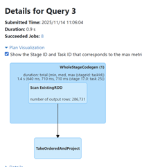
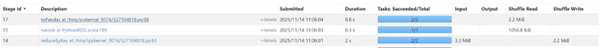
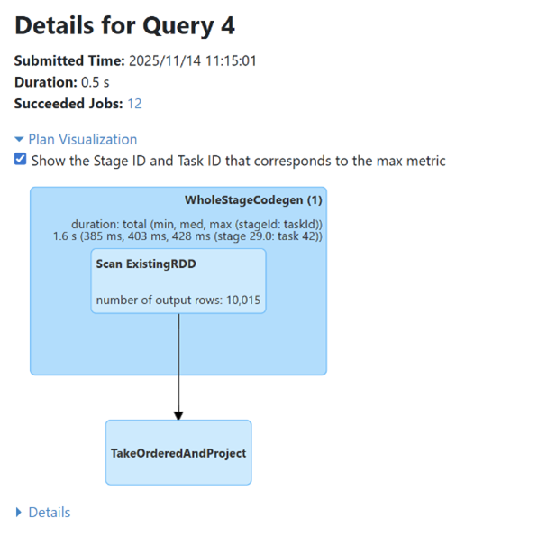
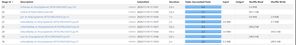
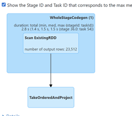
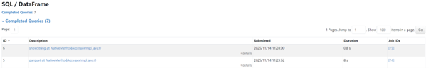
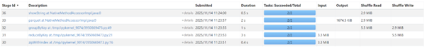
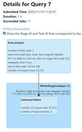
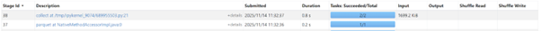

# Rapport - Assignement 02: Text Analytics avec PySpark

**Auteur :** Owen BRAUX et Elliot CAMBIER 
**Cours :** Big Data Analytics (ESIEE 2025-2026)

---

## Introduction

Ce document présente le travail qu'on a réalisé pour l'Assignement 02. L'objectif était d'utiliser PySpark pour implémenter des patrons d'analyse de texte plus avancés.

Le projet avait quatre parties :

-   **Partie A :** Calculer la fréquence relative des bigrammes avec deux méthodes : "Pairs" et "Stripes".
-   **Partie B :** Calculer la PMI (Pointwise Mutual Information) avec un seuil et une troncature de ligne.
-   **Partie C :** Construire un index inversé complet et un moteur de recherche booléen (AND/OR).
-   **Partie D :** Une étude de performance pour analyser nos choix.

---

## Partie A : Fréquence Relative des Bigrammes

### Objectif
Trouver la fréquence relative `f(w_i, w_{i+1}) / f(w_i, *)`. On a implémenté les deux approches "Pairs" et "Stripes" pour les comparer.

---

### A.1 - Approche "Pairs"

#### Comment on a fait
-   **Lecture & Tokenisation :** On a utilisé le `tokenized_lines_rdd`.
-   **Comptage Paires :** Un `flatMap` pour émettre `((w1, w2), 1)` suivi d'un `reduceByKey` pour les compter.
-   **Comptage Marginaux :** Un *deuxième* `flatMap` pour émettre `(w1, 1)` suivi d'un *deuxième* `reduceByKey`.
-   **Jointure & Calcul :** On a dû re-mapper le RDD des paires en `(w1, (w2, count))` pour pouvoir le **joindre** (`.join()`) avec le RDD des marginaux. Un `map` final a fait la division.
-   **Sauvegarde :** Résultats dans `outputs/bigram_pairs_top.csv`.

#### Preuves
-   **Plan d'exécution :** `proof/plan_bigrams_pairs.txt`.
-   **Capture d'écran Spark UI (Pairs) :**

**
**

---

### A.2 - Approche "Stripes"

#### Comment on a fait
-   **Génération des Stripes :** On a utilisé `flatMap` avec notre fonction `build_stripes` pour émettre des dictionnaires partiels `(w1, Counter({w2: 1}))`.
-   **Agrégation :** Un **seul** `reduceByKey(merge_counters)` a suffi pour fusionner tous les dictionnaires pour un même `w1`. C'est le seul shuffle de cette approche.
-   **Normalisation :** On a utilisé `flatMap` avec `normalize_stripe` pour parcourir chaque stripe agrégée, calculer le total, et émettre les lignes finales `(w1, w2, freq, count)`.
-   **Sauvegarde :** Résultats dans `outputs/bigram_stripes_top.csv`.

#### Preuves
-   **Plan d'exécution :** `proof/plan_bigrams_stripes.txt`.
-   **Capture d'écran Spark UI (Stripes) :**

**
**   

---

## Partie B : Calcul PMI avec Seuil K

### Objectif
Calculer la PMI en `log10` pour les paires de mots.
-   **Contrainte 1 :** On ne garde que les 40 premiers tokens de chaque ligne (`N_TOKENS = 40`).
-   **Contrainte 2 :** On ne garde que les paires qui apparaissent 10 fois ou plus (`K_THRESHOLD = 10`).

### Comment on a fait
-   **Troncature :** On a créé un `truncated_rdd` en appliquant `truncate_tokens(n=40)`.
-   **Comptages :** On a créé **trois** RDD de comptage à partir du `truncated_rdd` :
    1.  `pair_counts_rdd` (pour `Count(x,y)`)
    2.  `marginal_w1_counts_rdd` (pour `Count(x,*)`)
    3.  `marginal_w2_counts_rdd` (pour `Count(*,y)`)
-   **Optimisation (Broadcast) :**
    -   Pour calculer le PMI (`log10( (Count(x,y) * N) / (Count(x,*) * Count(*,y)) )`), on a besoin de 4 valeurs.
    -   Pour éviter des jointures multiples, on a collecté `marginal_w2_counts_rdd` sur le driver (`.collectAsMap()`) et calculé `N_pairs` (`.sum()`).
    -   On a ensuite **diffusé (broadcast)** ces deux variables (`N_pairs_bcast`, `w2_counts_bcast`) à tous les exécuteurs.
-   **Calcul Final :** On a fait une *seule* jointure entre `pair_counts_rdd` et `marginal_w1_counts_rdd`. La fonction `calculate_pmi` a ensuite utilisé les variables diffusées pour obtenir `N` et `Count(*,y)` et faire le calcul final, en appliquant le seuil K.
-   **Sauvegarde :** Échantillon dans `outputs/pmi_pairs_sample.csv`.

### Preuves
-   **Plan d'exécution :** `proof/plan_pmi.txt`.
-   **Capture d'écran Spark UI (PMI) :**
 
**
**

---

## Partie C : Index Inversé & Recherche Booléenne

### C.1 - Construction de l'Index Inversé

#### Objectif
Construire un index `(term, df, postings[doc_id, tf])` où un document = 10 lignes.

#### Comment on a fait
-   **Génération DocID :** On a utilisé `raw_rdd.zipWithIndex()` pour numéroter les lignes. Le `doc_id` est devenu `line_number // 10`.
-   **Calcul TF :** Un `flatMap` a émis `((term, doc_id), 1)`, suivi d'un `reduceByKey` pour calculer la fréquence (TF) de chaque mot dans chaque document.
-   **Inversion :** L'étape clé. On a re-mappé en `(term, (doc_id, tf))`, puis utilisé `groupByKey()` pour rassembler tous les postings (`(doc_id, tf)`) pour un même `term`.
-   **Formatage & Sauvegarde :** Un `mapValues` a formaté les listes de postings, puis on a créé un DataFrame en calculant le `df` (Document Frequency) avec `len(postings)`. Le tout a été sauvegardé en **Parquet** dans `outputs/index_parquet/`.

#### Preuves
-   **Plan d'exécution :** `proof/plan_index_build.txt`.
-   **Capture d'écran Spark UI (Index Build) :**

**
**
**

---

### C.2 - Recherche Booléenne

#### Objectif
Implémenter des requêtes AND/OR en utilisant notre index.

#### Comment on a fait
-   **Chargement :** On a lu le Parquet (`spark.read.parquet`) et on l'a **collecté entièrement sur le driver** (`.collect()`) dans un dictionnaire Python `index_local` pour des recherches instantanées.
-   **Requête OR (`evaluate_or`) :** On a utilisé un `defaultdict(int)`. Pour chaque terme de la requête, on parcourt sa liste de postings et on ajoute le `tf` au score du `doc_id`.
-   **Requête AND (`evaluate_and`) :** On a d'abord trouvé le document *commun* en faisant l'**intersection des ensembles** (sets) de `doc_id` (`common_docs.intersection_update(p.keys())`). Puis, on a calculé les scores (somme des `tf`) uniquement pour ces documents communs.
-   **Sauvegarde :** Résultats dans `outputs/queries_and_results.md`.

#### Preuves
-   **Capture d'écran Spark UI (Query) :**

**
**

---

## Partie D : Étude de Performance

## 8. Part D — Performance study

Cette section analyse les compromis de conception et l'impact des partitions de shuffle.

### 1. Comparaison "Pairs" vs "Stripes" (Partie A)

En analysant le fichier `lab2_metrics_log.csv`, on observe une différence de performance majeure entre nos deux implémentations :

| Tâche | Shuffle Write (bytes) | Analyse |
| :--- | :--- | :--- |
| **A1 (Pairs)** | 4 177 203 | L'approche "Pairs" a nécessité deux `reduceByKey` distincts, suivis d'une jointure (`.join()`) (Stage 8). Cette jointure est très coûteuse et génère un shuffle important pour regrouper les paires et les marginaux. |
| **B1 (Stripes)**| 2 306 867 | L'approche "Stripes" a été **~1.8x plus efficace**. En agrégeant localement les paires dans un dictionnaire (`Counter`), nous n'avons eu besoin que d'un seul `reduceByKey` (Stage 14) et avons **totalement évité la jointure**. |

**Conclusion :** Le patron "Stripes" est supérieur car il minimise le trafic réseau en effectuant une pré-agrégation (combiner) côté map avant le shuffle.

### 2. Impact de `spark.sql.shuffle.partitions`

J'ai relancé le job "Stripes" (Partie A) en variant le nombre de partitions :

### Bigram Stripes – Partition Metrics

| run_id | task            | note          | files_read | input_size_bytes | shuffle_read_bytes | shuffle_write_bytes | duration_s | timestamp              |
|--------|------------------|---------------|------------|-------------------|---------------------|----------------------|-------------|-------------------------|
| B1     | bigram_stripes   | partition=4   | 0          | 3 460 301         | 2 306 867           | 2 306 867            | 0.9         | 2025-11-14T11:06:04     |
| B2     | bigram_stripes   | partition=2   | 0          | 3 460 301         | 2 306 867           | 2 306 867            | 1.1         | 2025-11-14T11:21:49     |
| B3     | bigram_stripes   | partition=8   | 0          | 3 460 301         | 2 306 867           | 2 306 867            | 1.1         | 2025-11-14T11:23:13     |
| B4     | bigram_stripes   | partition=16  | 0          | 3 460 301         | 2 306 867           | 2 306 867            | 1.3         | 2025-11-14T11:24:20     |

**Analyse :**

On observe deux choses :

- Le volume total de données mélangées (`shuffle_write_bytes`) reste constant à 2.3 Mo, quel que soit le nombre de partitions.  
  C'est normal : la quantité totale de données à trier ne change pas, seule la façon de les répartir change.

- Le temps d'exécution (`duration_s`) varie.  
  Le réglage `partition=4` est le plus rapide (0.9s). En dessous (`partition=2`) ou au-dessus (`partition=8` et `partition=16`), le job est plus lent (1.1s à 1.3s).

**Conclusion :**  
`partitions=4` est le "point idéal" (sweet spot) pour ce volume de données.  
Avec trop peu de partitions (2), le travail n'est pas assez parallélisé.  
Avec trop de partitions (16), le surcoût de gestion (overhead) de Spark pour administrer de nombreuses petites tâches devient plus long que le gain en parallélisme.

---

## Métriques & Reproductibilité

-   **Environnement :** Détails dans `ENV.md`.
-   [cite_start]**Métriques Spark :** Consignées dans `lab2_metrics_log.csv`[cite: 1].

#### [cite_start]Metrics Log [cite: 1]

| run_id | task | note | files_read | input_size_bytes | shuffle_read_bytes | shuffle_write_bytes | timestamp |
| :--- | :--- | :--- | :--- | :--- | :--- | :--- | :--- |
| A1 | bigram_pairs | 6-9 | 0 | 3460301 | 2516582 | 4177203 | 2025-11-14T10:50:34 |
| B1 | bigram_stripes | 14-17 | 0 | 3460301 | 2306867 | 2306867 | 2025-11-14T11:06:04 |
| C1 | pmi_pairs | 18-29 | 0 | 3460301 | 7324979 | 7010406 | 2025-11-14T11:15:01 |
| D1 | inverted_index | 30-33 | 0 | 3460301 | 8808038 | 8808038 | 2025-11-14T11:24:00 |
| E1 | boolean_retrieval | 37-38 | 2 | 1739981 | 0 | 0 | 2025-11-14T11:32:37 |

---

## Conclusion Générale du Lab

L'analyse du fichier `lab2_metrics_log.csv`  nous a permis de bien comparer nos cinq tâches.

D'abord, on voit que la tâche **`boolean_retrieval` (E1)** est la seule à n'avoir **aucun shuffle** (0 bytes). C'est logique : on a lu les fichiers Parquet (`files_read = 2`) et on a tout collecté sur le driver. Le traitement s'est fait localement en Python, sans shuffle.

Ensuite, les tâches `pmi_pairs` (C1) et `inverted_index` (D1) sont les plus lourdes, générant **7.0 Mo** et **8.8 Mo** en écriture de shuffle. C'est normal :
-   La **PMI (C1)** a nécessité plusieurs comptages et une jointure coûteuse.
-   L'**Index (D1)** a nécessité un `reduceByKey` suivi d'un `groupByKey`, qui est une opération très lourde en shuffle.

Le point le plus important est la comparaison (Partie A) entre **"Pairs" (A1)** et **"Stripes" (B1)**.
On remarque que **"Stripes" (B1)** a généré **2.3 Mo** de shuffle write, contre **4.2 Mo** pour **"Pairs" (A1)**.

L'approche **"Stripes" a été presque deux fois plus efficace**.

L'explication est que **"Pairs" (A1)** a nécessité deux shuffles séparés (un pour les paires, un pour les marginaux) suivis d'un *troisième* shuffle pour la jointure (Stage 8). Alors que **"Stripes" (B1)** a fait une pré-agrégation locale dans des dictionnaires et n'a eu besoin que d'**un seul shuffle** (`reduceByKey`, Stage 14) pour fusionner ces dictionnaires. En évitant la jointure, on a drastiquement réduit le trafic réseau.